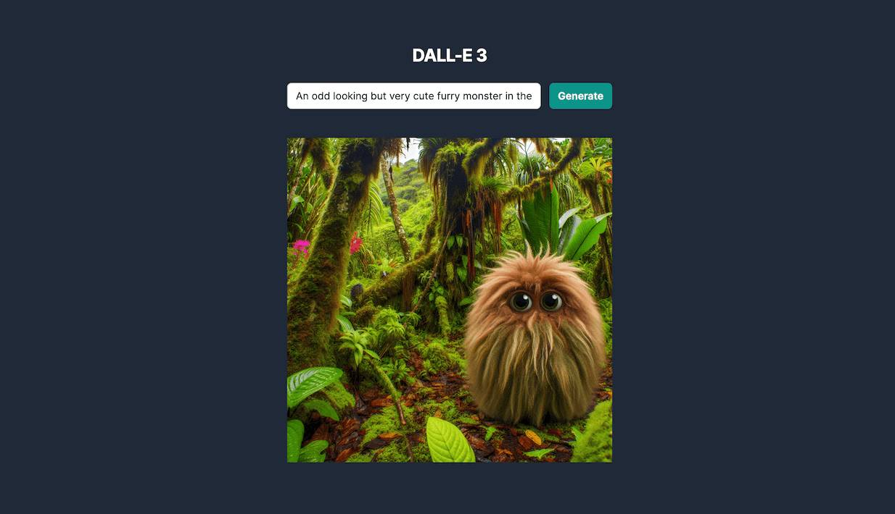
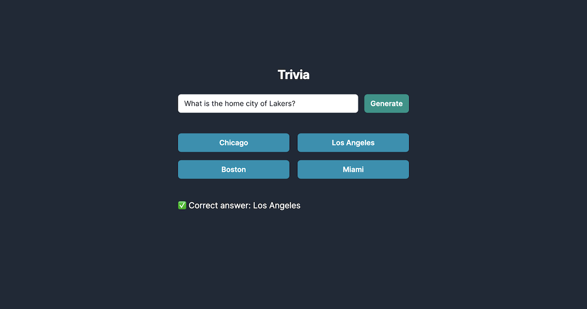

# Getting Started with OpenAI SDK

## Resources

This project is inspired by [Colby Fayock](https://github.com/colbyfayock)'s course on egghead.io [Get Started with AI-Driven App Development Using the OpenAI Node.js SDK](https://egghead.io/courses/get-started-with-ai-driven-app-development-using-the-openai-node-js-sdk-b8d4b04e?af=atzgap)

## Setup

```sh
cp .env.local.template .env.local

# Add your OpenAI API Key

npm run dev
```

## Routes

- [dall-e](http://localhost:3000/dall-e)
  - [hello-image](http://localhost:3000/hello-image)
- [trivia](http://localhost:3000/trivia)
  - [hello-chat](http://localhost:3000/hello-chat)

## Screenshots

**DALL-E 3**



**Chat Completion**


